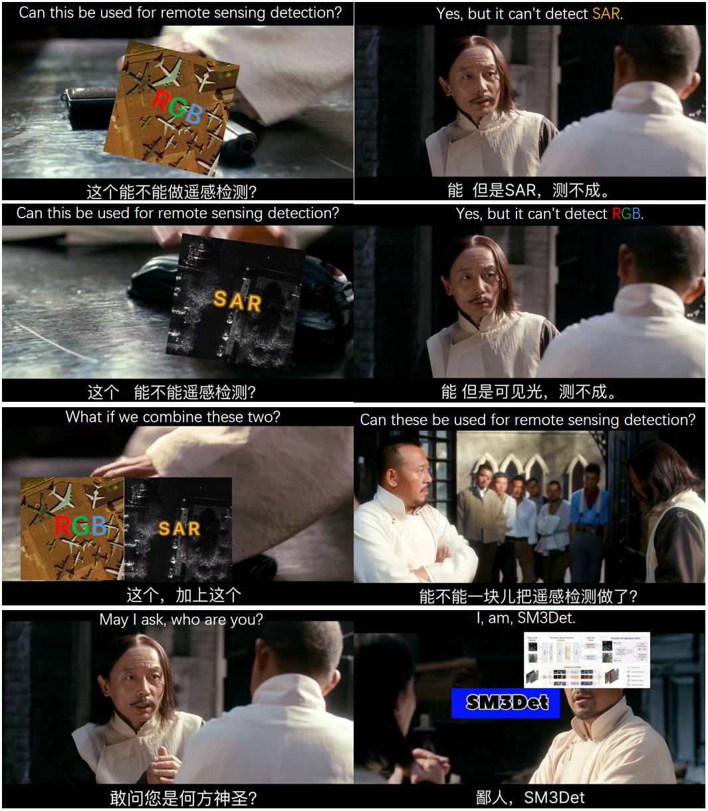
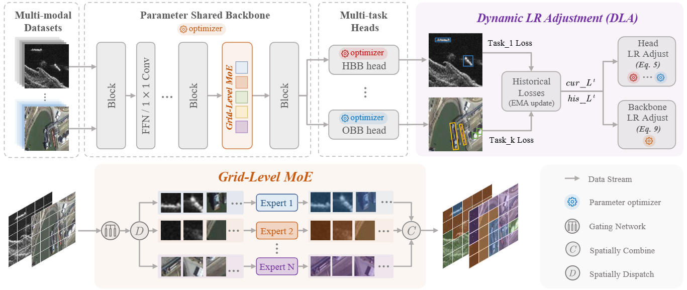
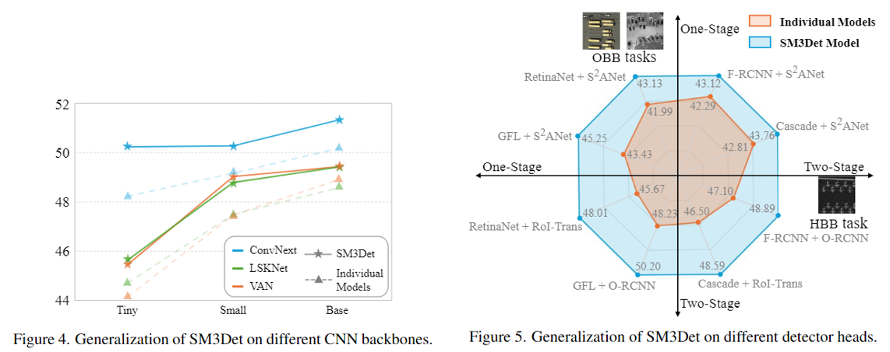
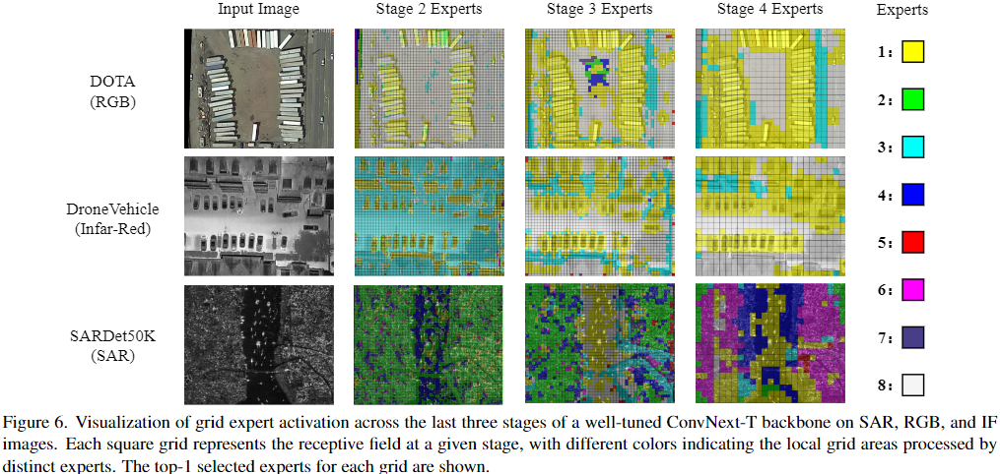

## This repository is the official implementation of ArXiv "[SM3Det: A Unified Model for Multi-Modal Remote Sensing Object Detection](http://arxiv.org/abs/2412.20665 )"




## Abstract

With the rapid advancement of remote sensing technology, high-resolution multi-modal imagery is now more widely accessible. Conventional Object detection models are trained on a single dataset, often restricted to a specific imaging modality and annotation format. However, such an approach overlooks the valuable shared knowledge across multi-modalities and limits the model's applicability in more versatile scenarios. This paper introduces a new task called Multi-Modal Datasets and Multi-Task Object Detection (M2Det) for remote sensing, designed to accurately detect horizontal or oriented objects from any sensor modality. This task poses challenges due to 1) the trade-offs involved in managing multi-modal modelling and 2) the complexities of multi-task optimization. To address these, we establish a benchmark dataset and propose a unified model, SM3Det (Single Model for Multi-Modal datasets and Multi-Task object Detection). SM3Det leverages a grid-level sparse MoE backbone to enable joint knowledge learning while preserving distinct feature representations for different modalities. Furthermore, it integrates a consistency and synchronization optimization strategy using dynamic learning rate adjustment, allowing it to effectively handle varying levels of learning difficulty across modalities and tasks. Extensive experiments demonstrate SM3Det's effectiveness and generalizability, consistently outperforming specialized models on individual datasets.



## SM3Det Model 

**Model Architecture:**

- We propose integrating a plug-and-play grid-level sparse Mixture of Experts (MoE) architecture into backbone networks, enabling the model to capture both shared knowledge and modality-specific representations. Through dynamic routing, the experts operate on local spatial features, allowing the model to adaptively process information at a grid level, which is crucial for object detection tasks. 

**Model Optimization:**

- We propose a novel Dynamic Learning Rate Adjustment (DLA) method that adaptively adjusts the learning rates of different network components with tailored policies. DLA accommodates the varying learning complexities across different tasks and modalities by balancing the relative convergence rate and guaranteeing optimization direction consistency. 
Unlike traditional techniques that primarily modify loss weights or gradients—often lacking precise manipulation over specific network submodules or suffering from inefficiencies—our DLA provides fine-grained control while maintaining optimization efficiency.

The master branch is built on MMRotate which works with **PyTorch 1.6+**.

Main configuration files are put under configs/SM3Det/


**SOI-Det DATASET DOWNLOAD at:** 

* [Dataset](https://www.kaggle.com/datasets/greatbird/soi-det) 

## Results and models



-----



-----

<table><thead>
  <tr>
    <th>Model</th>
    <th>FLOPs</th>
    <th>#P</th>
    <th>Test on</th>
    <th>mAP</th>
    <th>@50</th>
    <th>@75</th>
    <th>config</th>
    <th>log/ckpt</th>
  </tr></thead>
<tbody>
  <tr>
    <td>3 models</td>
    <td>403G</td>
    <td>126M</td>
    <td>Overall</td>
    <td>48.23</td>
    <td>79.39</td>
    <td>51.26</td>
    <td><a href="local_configs/sardet50k_convnext_t_gfl.py"> 1 </a> <a href="local_configs/dota_convnext_t_orcnn.py"> 2 </a> <a href="local_configs/dronevehicle_convnext_t_orcnn.py"> 3 </a> </td>
    <td><a href="https://www.kaggle.com/models/greatbird/sm3det"> here </a></td>
  </tr>
  <tr>
    <td>Simple<br>Joint<br>Training</td>
    <td>403G</td>
    <td>66M</td>
    <td>Overall</td>
    <td>47.05</td>
    <td>77.56</td>
    <td>50.11</td>
    <td><a href="main_convnext_t_orcnn_gfl_simple_joint.py"> here </a></td>
    <td><a href="https://www.kaggle.com/models/greatbird/sm3det"> here </a></td>
  </tr>
  <tr>
    <td>DA<br></td>
    <td>403G</td>
    <td>66M</td>
    <td>Overall</td>
    <td>48.37</td>
    <td>79.76</td>
    <td>51.66</td>
    <td><a href="local_configs/main_DA_convnext_t_orcnn_gfl.py"> here </a></td>
    <td><a href="https://www.kaggle.com/models/greatbird/sm3det"> here </a></td>
  </tr>
  <tr>
    <td>UniDet<br></td>
    <td>403G</td>
    <td>66M</td>
    <td>Overall</td>
    <td>48.47</td>
    <td>79.55</td>
    <td>52.01</td>
    <td><a href="local_configs/main_unidet_convnext_t_orcnn_gfl.py"> here </a></td>
    <td><a href="https://www.kaggle.com/models/greatbird/sm3det"> here </a></td>
  </tr>
  <tr>
    <td>Uncertainty <br>loss</td>
    <td>403G</td>
    <td>66M</td>
    <td>Overall</td>
    <td>48.79</td>
    <td>79.99</td>
    <td>52.50</td>
    <td><a href="local_configs/main_uncertainty_convnext_t_orcnn_gfl.py"> here </a></td>
    <td><a href="https://www.kaggle.com/models/greatbird/sm3det"> here </a></td>
  </tr>
  <tr>
    <td>SM3Det <br>lightweighted</td>
    <td>403G</td>
    <td>66M</td>
    <td>Overall</td>
    <td>49.40</td>
    <td>80.19</td>
    <td>52.93</td>
    <td><a href="local_configs/main_SM3Det_convnext_t_orcnn_gfl_wo_moe.py"> here </a></td>
    <td><a href="https://www.kaggle.com/models/greatbird/sm3det"> here </a></td>
  </tr>
  <tr>
    <td>SM3Det</td>
    <td>487G</td>
    <td>178M</td>
    <td>Overall</td>
    <td>50.20</td>
    <td>80.68</td>
    <td>53.79</td>
    <td><a href="configs/SM3Det_convnext_t.py"> here </a></td>
    <td><a href="https://www.kaggle.com/models/greatbird/sm3det"> here </a></td>
  </tr>
</tbody></table>


## Installation

MMRotate depends on [PyTorch](https://pytorch.org/), [MMCV](https://github.com/open-mmlab/mmcv) and [MMDetection](https://github.com/open-mmlab/mmdetection).
Below are quick steps for installation.
Please refer to [Install Guide](https://mmrotate.readthedocs.io/en/latest/install.html) for more detailed instruction.

```shell
conda create --name openmmlab python=3.8 -y
conda activate openmmlab
conda install pytorch==1.8.0 torchvision==0.9.0 cudatoolkit=10.2 -c pytorch
pip install -U openmim
mim install mmcv-full
mim install mmdet
git clone https://github.com/zcablii/SM3Det.git
cd SM3Det
pip install -v -e .
```

## Get Started

Please see [get_started.md](docs/en/get_started.md) for the basic usage of MMRotate.
We provide [colab tutorial](demo/MMRotate_Tutorial.ipynb), and other tutorials for:

- [learn the basics](docs/en/intro.md)
- [learn the config](docs/en/tutorials/customize_config.md)
- [customize dataset](docs/en/tutorials/customize_dataset.md)
- [customize model](docs/en/tutorials/customize_models.md)
- [useful tools](docs/en/tutorials/useful_tools.md)
 


## Acknowledgement

MMRotate is an open source project that is contributed by researchers and engineers from various colleges and companies. We appreciate all the contributors who implement their methods or add new features, as well as users who give valuable feedbacks. We wish that the toolbox and benchmark could serve the growing research community by providing a flexible toolkit to reimplement existing methods and develop their own new methods.

## Citation

If you use this toolbox or benchmark in your research, please cite this project.

```bibtex
@inproceedings{Li_2026_sm3det,
    author    = {Li, Yuxuan and Li, Xiang and Li, Yunheng and Zhang Yicheng and Dai, Yimian and Hou, Qibin and Cheng, Ming-Ming and Yang, Jian},
    title     = {SM3Det: A Unified Model for Multi-Modal Remote Sensing Object Detection},
    booktitle = {AAAI},
    year      = {2026}
}
```

## License
Licensed under a [Creative Commons Attribution-NonCommercial 4.0 International](https://creativecommons.org/licenses/by-nc/4.0/) for Non-commercial use only.
Any commercial use should get formal permission first.
